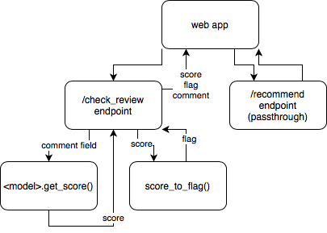

# Allay DS API

## Tech stack
- [FastAPI](https://fastapi.tiangolo.com) 0.54.1
- [Heroku](https://heroku.com)

## Documentation
- [Allay DS API Documentation](https://allay-ds.herokuapp.com/docs)
- [Allay DS API Redoc Documentation](https://allay-ds.herokuapp.com/redoc)

## Diagram


## Instructions
install virtual environment (in repo root)
```
pipenv install --python=3.7.6
```

enter virtual environment (in repo root)
```
pipenv shell
```

launch locally
```
cd allay-ds-api
uvicorn fastapi_app:APP --reload
```

push to heroku staging (in repo root)
```
git checkout feature/<your-feature-name>
git subtree push --prefix allay-ds-api staging master
```

Heroku is setup to automatically deploy to production environment on merge to master.
